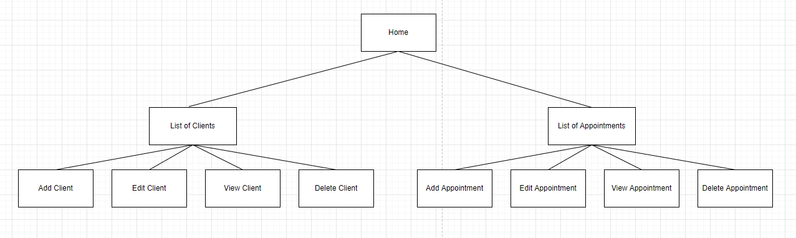

# Workflow

1. Pick an issue no one is working on, and assign yourself
2. Create new branch where you will push code related to the issue
3. When done with implementation, create pull request and ping trainers for code review
4. Once code is reviewed and everything looks good it can be merged to main branch

## Additional notes:
* Always link pull request to the issue - there are multiple ways to do it - when you go to issue details look under Development - you can create branch from here and when you create pull request for that branch it will be automatically linked with the issue; or alternatively choose existing pull request to link it
* When you are working on the feature, if you have any questions, or something is not clear, or you have suggestions how it can be improved, don't be shy to reach out to trainers for consultation

# Clients-Appointments Application specification
## Use Cases
* Home Page
    - User should be able to choose between List of Clients and List of Appointments
    - clicking on clients should redirect to client list page <b> /clients </b>
    - clicking on appointments should redirect to appointments list page <b> /appointments </b>
* List of Clients
    - User should see the list of clients
    - clients are loaded with: <b>GET /api/clients</b>
    - all fields are shown apart from id
    - if field contains more then 15 chars (Hubert Blaine Wolfeschlegelsteinhausenbergerdorff Sr.), something like this should be shown: 'Hubert Blaine W...' and we should have a tooltip showing entire name as well as cursor changed to pointer
    - table should be sorted by id as a default sort
    - user should be able to sort table using all fields asc and desc (OPTIONAL)
* Add Client
    - User should see the button on list of clients page
    - button should redirect to another page using react router <b>/addClient</b>
    - page content:
        - name - type string - mandatory
           - (0 > number of chars > 30)
           - cannot contain special chars - !"#$%&'()*+,-./:;<=>?@[\]^_`{|}~
           - cannot contain numbers
        - surname - type string - mandatory
            - (0 > number of chars > 30)
            - cannot contain special chars - !"#$%&'()*+,-./:;<=>?@[\]^_`{|}~
            - cannot contain numbers
        - address - type string
            - (0 > number of chars > 30)
            - cannot contain special chars - !"#$%&'()*+,-./:;<=>?@[\]^_`{|}~
        - phoneNumber - type number
            - (0 > number of chars > 30)
        - email - type string - mandatory
            - must be a valid email using regex
        - back button returns to home page
        - save page button
            - is enabled if all mandatory fields are filled
            - makes request <b>POST /api/saveClient</b> body contains all fields mentioned
    - if save request is successful, user should be navigated to home page and we should show successful toast 'Success!'
    - if save request is not successful, user remains on the same page and error toast should be shown 'Error!'
    - if the same combination of name + surname + email exist, we need to disable save button
* Edit client
    - User should see the button on each client row on far right
    - button should redirect to another page using react router <b>/editClient/{clientId}</b>
    - all fields that has data must be filled
    - page content:
        - name - type string - mandatory
           - (0 > number of chars > 30)
           - cannot contain special chars - !"#$%&'()*+,-./:;<=>?@[\]^_`{|}~
           - cannot contain numbers
        - surname - type string - mandatory
            - (0 > number of chars > 30)
            - cannot contain special chars - !"#$%&'()*+,-./:;<=>?@[\]^_`{|}~
            - cannot contain numbers
        - address - type string
            - (0 > number of chars > 30)
            - cannot contain special chars - !"#$%&'()*+,-./:;<=>?@[\]^_`{|}~
        - phoneNumber - type number
            - (0 > number of chars > 30)
        - email - type string - mandatory
            - must be a valid email using regex
        - back button returns to home page
        - edit page button
            - is enabled if all mandatory fields are filled
            - makes request <b>PUT /api/editClient</b> body contains all fields mentioned and id
    - if edit request is successful, user should be navigated to home page and we should show successful toast 'Success!'
    - if save request is not successful, user remains on the same page and error toast should be shown 'Error!'
    - if the same combination of name + surname + email shows, we need to disable edit button
* View client
    - User should see the button on each client row on far right
    - button should redirect to another page using react router <b>/viewClient/{clientId}</b>
    - all fields that has data must be filled and disabled
    - page content:
        - name
        - surname
        - address
        - phoneNumber
        - email
        - back button returns to home page
* Delete client
    - user should see the button on each client on far right
    - button should open dialog containing 2 buttons
        - delete (makes an api call <b>DELETE /api/client?id={clientID}</b>)
    - if delete request is successful, dialog should be closed and we should show successful toast 'Success!'
    - if save request is not successful, dialog should be closed and we should show error toast 'Error!'
* List of Appointments
    - User should see the list of appointments
    - Appointments are loaded with: <b>GET /api/appointments</b>
    - all fields are shown apart from id
    - corresponding client name and surname should be shown in the table
    - if field contains more then 15 chars (Hubert Blaine Wolfeschlegelsteinhausenbergerdorff Sr.), something like this should be shown: 'Hubert Blaine W...' and we should have a tooltip showing entire name as well as cursor changed to pointer
    - table should be sorted by date as a default sort
* Add Appointment
    - User should see the button on list of appointments page
    - button should redirect to another page using react router <b>/addAppointment</b>
    - page content:
        - date - type date - mandatory
            - should use date picker
            - can only enter future date
        - clientId - type number - mandatory
            - should use dropdown to select client, name, surname and email is shown as option
        - save page button
            - is enabled if all mandatory fields are filled
            - makes request <b>POST /api/saveAppointment</b> body contains all fields mentioned
    - if save request is successful, user should be navigated to list page and we should show successful toast 'Success!'
    - if save request is not successful, user remains on the same page and error toast should be shown 'Error!'
    - if the same combination of date + clientId exist, we need to disable save button
* Edit appointment
    - User should see the button on each appointment row on far right
    - button should redirect to another page using react router <b>/editAppointment/{appointmentId}</b>
    - all fields that has data must be filled
    - page content:
        - date - type date - mandatory
            - should use date picker
            - can only enter future date
        - clientId - type number - mandatory
            - should use dropdown to select client, name, surname and email is shown as option
        - edit page button
            - is enabled if all mandatory fields are filled
            - makes request <b>PUT /api/editAppointment</b> body contains all fields mentioned and id
    - if edit request is successful, user should be navigated to home page and we should show successful toast 'Success!'
    - if save request is not successful, user remains on the same page and error toast should be shown 'Error!'
    - if the same combination of name + surname + email shows, we need to disable edit button
* View appointment
    - User should see the button on each appointment row on far right
    - button should redirect to another page using react router <b>/viewAppointment/{appointmentId}</b>
    - all fields that has data must be filled and disabled
    - page content:
        - date
        - client name and surname and email
        - back button returns to home page
* Delete appointment
    - user should see the button on each appointment on far right
    - button should open dialog containing 2 buttons
        - delete (makes an api call <b>DELETE /api/appointment?id={appointmentID}</b>)
    - if delete request is successful, dialog should be closed and we should show successful toast 'Success!'
    - if save request is not successful, dialog should be closed and we should show error toast 'Error!'
## API
* GET /api/clients
* POST /api/saveClient
    - payload example
    ```json
    {
        "name": "John",
        "surname": "Smith",
        "address": "Baker Street 46",
        "phoneNumber": "321456987",
        "email": "john.smith@yahoo.com",
    }
    ```
* PUT /api/editClient
    - payload example
    ```json
    {
        "id": "76",
        "name": "John",
        "surname": "Smith",
        "address": "Baker Street 47",
        "phoneNumber": "321456987",
        "email": "john.smith@yahoo.com",
    }
    ```
* DELETE /api/client?id=76
* GET /api/appointments
* POST /api/saveAppointment
    - payload example
    ```json
    {
        "date": "22-10-2022", // other format can be used, but it needs to be unanimous
        "clientId": "76",
    }
    ```
* PUT /api/editAppointment
    - payload example
    ```json
    {
        "id": "11",
        "date": "23-10-2022", // other format can be used, but it needs to be unanimous
        "clientId": "76",
    }
    ```
* DELETE /api/appointment?id=11


